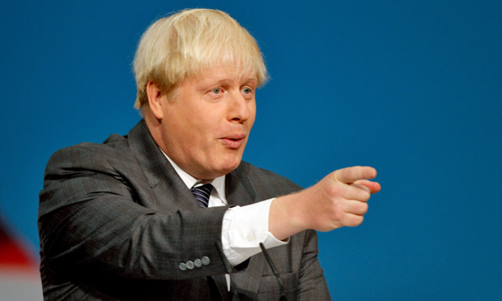

# Boris - Unofficial Transport for London API bindings

## Usage

Get the next five bus arrivals at Great Titchfield Street.

### CLI

<pre>boris 51889</pre>

### Ruby

<pre>
Boris::BusStop.find(51889).arrivals.take 5
</pre>

